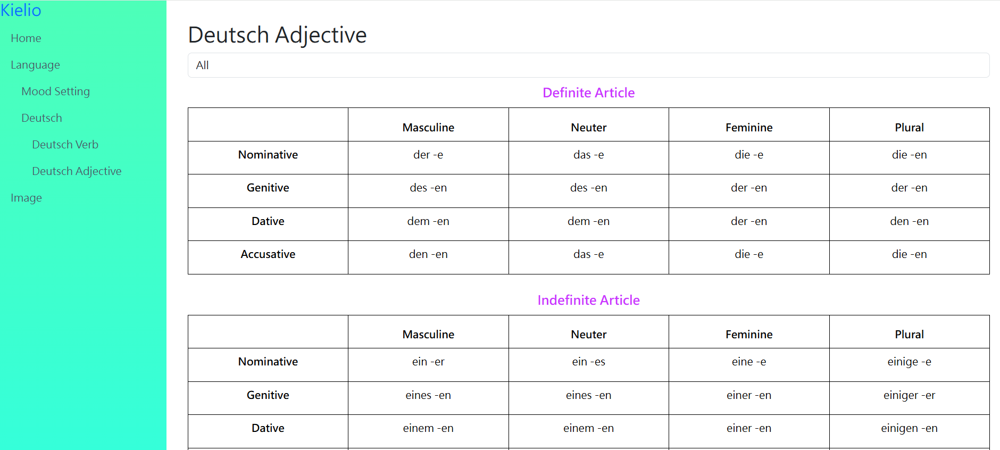
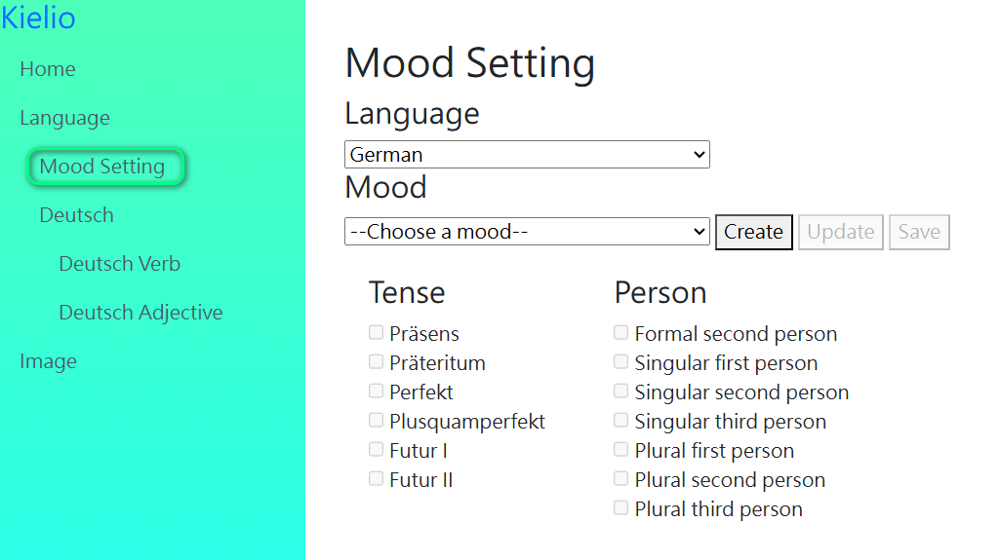

# Web app for language learning
* Tables to display German adjective suffixes by choosing type.
* Settings for the connection between mood, tense, and person by languages.

## Technologies Used
* C#
* .NET 10
* ASP .NET core MVC
* SQL Server

## Using The App
1. Deutsch Adjective
   Choose type (All / Definite Article / Indefinite Article / No Article / Gentitive), then display tables that shows each German adjective suffix by genders and cases.
   
   
2. Mood Setting
   2.1. Choose a language => It will bring out moods, tenses, persons of the language. Create button is enable, that is to add more moods and sebsequently set the applicable tenses and persons.
   2.2. Choose a Mood => It will bring out the applicable tense and person. Modify button is enable, that is to change the setting of applicable tenses and persons.
   

## Upcoming Changes
* Mood Setting: Add Create, Modify
* Deutsch Verb: Add German Verb page that shows the conjugation based on Mood Settings
* Create French Verb page
