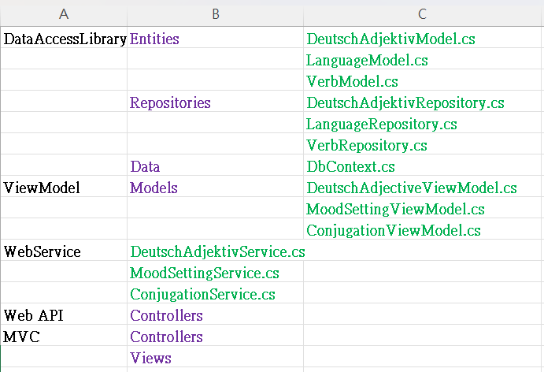
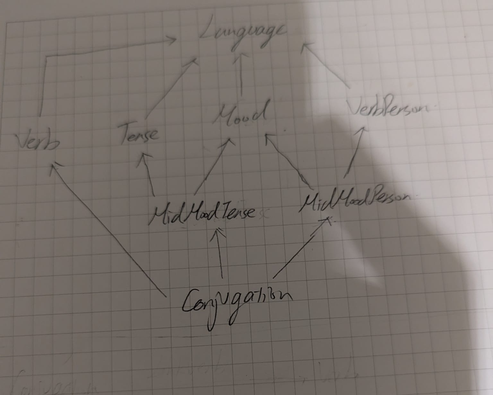

# Web app for language learning
* Tables to display German adjective suffixes by choosing type.
* Settings for the connection between mood, tense, and person by languages.

## Technologies Used
* C#
* .NET 10
* ASP .NET core MVC
* SQL Server
* ASP .NET core Web API

## Archtecture Design
* Controller - Handles HTTP requests and responses
* Service - Contains business logic and workflow control
* Repository - Encapsulates data access and ORM operations
* Entity - Defines domain models and database structure

## Project Structure
Column A - First layer  
Column B - Second layer  
Column C - Third layer  
Purple -> Folders  
Green -> Files  

## Database Design
* EF Core Code First approach
* Table relationships and indexes are defined in the model configuration
* Each Entity maps directly to a database table

## Request Flow Example
HTTP Request -> Controller -> Service -> Repository -> DbContext

## Using The App
### 1. ASP .NET core MVC
#### 1.1. Deutsch Adjective
To show suffixes of Gernman Adjectives and Articles by choosing a type before adjectives, then tables are displayed under the type condition, that shows the suffixes changes by cases and single/plural.  
##### 1.1.1. Choose type (All / Definite Article / Indefinite Article / No Article / Gentitive), then display tables that shows each German adjective suffix by genders and cases.  

   
#### 1.2. Mood Setting      
In every language, verb forms are changing based on moods, tenses, and, persons. This function shows moods and applicable tenses and persons of each language.  
##### 1.2.1. Choose a language => It will bring out moods, tenses, persons of the language. Create button is enable, that is to add more moods and sebsequently set the applicable tenses and persons.  
##### 1.2.2. Choose a Mood => It will bring out the applicable tense and person. Modify button is enable, that is to change the setting of applicable tenses and persons.

### 2. ASP .NET core Web API
#### 2.1. Deutsch Adjective
API that correspond to 1.1, that can be called by other frontend App. (get only)

#### 2.2. Mood Setting
API that correspond to 1.2, that can be called by other frontend App.
   
## Upcoming Changes
* Mood Setting: Add Create, Modify
* Deutsch Verb: Add German Verb page that shows the conjugation based on Mood Settings
* Create French Verb page
